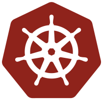

  

# Chain Reaction

An in-cluster Kubernetes agent that validates multi-step attack chains.

## Problem

Kubernetes security scanners find *possible* risks, but they don't prove what's *actually exploitable* from inside a compromised Pod. You get a list of theoretical attack paths without evidence of which ones work.

## Solution

Chain Reaction runs as a standard Kubernetes Pod and tests attack chains for real. It validates each step by actually executing it, capturing evidence (API responses, object snapshots), and recording why steps succeed or fail.

## Key Features

- **Assumed-breach model:** Runs as a normal Pod with real ServiceAccount credentials
- **Runtime validation:** Tests chains instead of guessing from configuration
- **Safe execution:** Read-only probes, rate limits, time budgets, allow-lists
- **Evidence-backed:** Raw API responses, timestamps, and object snapshots
- **Attack graph output:** Phase-labeled graph with validated vs theoretical edges

## Documentation

- [Kubernetes background & exploits](docs/draft/k8s-background-research.md)
- [Similar projects & tools](docs/draft/similar-projects.md)
- [Abstract](docs/draft/abstract.md)

## Prerequisites

- Kubernetes cluster (kind/minikube for dev, Kubernetes Goat for testing)
- Go 1.21+
- kubectl

## Quick Start

(Coming soon)

## Safety

**For lab environments only.** Actions are bounded by allow-lists, rate limits, and time budgets.

## License

[CC BY-NC 4.0](https://creativecommons.org/licenses/by-nc/4.0/deed.en)
