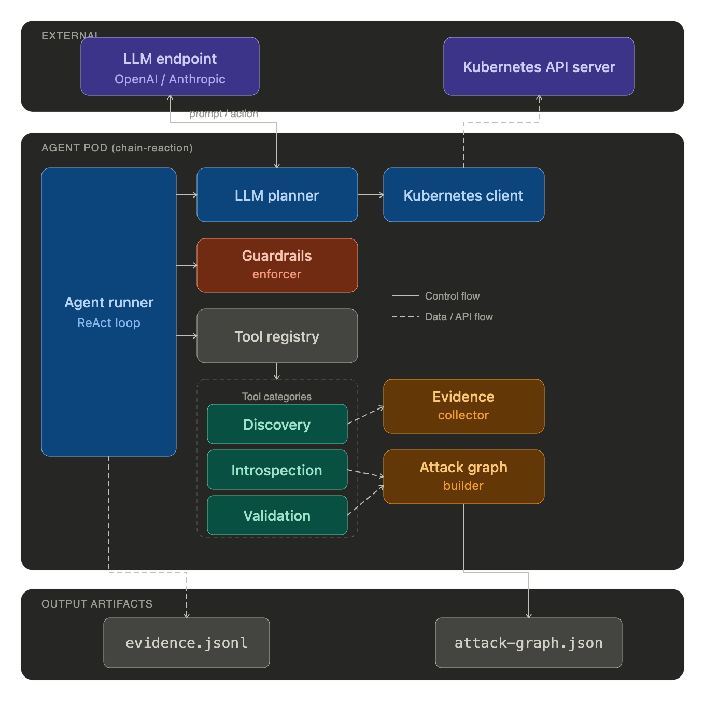
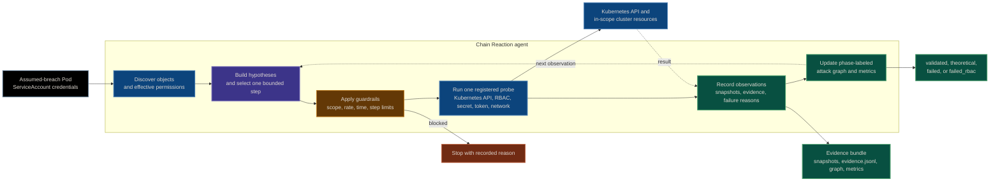

# Chain Reaction

Chain Reaction is an evidence-verifiable Kubernetes security validation agent. It starts from an assumed-breach Pod identity, discovers candidate attack paths, and tests whether individual transitions can be executed from inside the cluster.

The project is designed to answer a practical question: which paths are merely possible according to cluster configuration, and which ones are supported by runtime evidence?



## How it works

Chain Reaction uses a bounded plan-act-observe workflow:


```mermaid
flowchart LR
    identity["Assumed-breach Pod<br/>ServiceAccount credentials"] --> discover["Discover objects<br/>and effective permissions"]

    subgraph agent["Chain Reaction agent"]
        direction TB
        discover --> plan["Build hypotheses<br/>and select one bounded step"]
        plan --> enforce["Apply guardrails<br/>scope, rate, time, step limits"]
        enforce --> probe["Run one registered probe<br/>Kubernetes API, RBAC, secret, token, network"]
        probe --> observe["Record observations<br/>snapshots, evidence, failure reasons"]
        observe --> attackGraph["Update phase-labeled<br/>attack graph and metrics"]
        attackGraph -. next observation .-> plan
    end

    probe --> api["Kubernetes API and<br/>in-scope cluster resources"]
    api -. result .-> observe
    observe --> artifacts["Evidence bundle<br/>snapshots, evidence.jsonl, graph, metrics"]
    enforce -->|"blocked"| stopped["Stop with recorded reason"]
    attackGraph --> result["validated, theoretical,<br/>failed, or failed_rbac"]

    classDef input fill:#000000,stroke:#566F87,color:#DED8D1,stroke-width:2px;
    classDef action fill:#0C447C,stroke:#497EB3,color:#DED8D1,stroke-width:2px;
    classDef planner fill:#3C3489,stroke:#6E65B5,color:#DED8D1,stroke-width:2px;
    classDef guard fill:#633806,stroke:#B7741B,color:#DED8D1,stroke-width:2px;
    classDef evidence fill:#085041,stroke:#4DA06D,color:#DED8D1,stroke-width:2px;
    classDef stop fill:#712B13,stroke:#B65A39,color:#DED8D1,stroke-width:2px;

    class identity input;
    class discover,probe,api action;
    class plan planner;
    class enforce guard;
    class observe,attackGraph,artifacts,result evidence;
    class stopped stop;
```

The agent uses only the Pod's assigned ServiceAccount credentials and ordinary cluster networking. A step is marked `validated` only when the matching probe succeeds and produces supporting evidence. A step can instead remain `theoretical`, fail because of RBAC or reachability, or stop because a guardrail blocks it.

The workflow has two execution modes:

- `scan` runs a deterministic discovery-only baseline. It does not call an LLM or claim that discovered paths are exploitable.
- `validate` runs the LLM-guided validation loop. The planner selects from registered tools while the agent tracks observations, hypotheses, graph state, and termination conditions.

## What it validates

The tool suite covers Kubernetes-native attack-chain preconditions and proof actions:

- Discovery of Pods, Services, Endpoints, ServiceAccounts, ConfigMaps, Secrets, NetworkPolicies, namespaces, and RBAC objects
- Effective permission inspection through Roles, RoleBindings, ClusterRoles, and ClusterRoleBindings
- Secret-access checks using the running identity
- ServiceAccount token inspection
- Bounded network probes for TCP, HTTP, and DNS reachability

Validation is intentionally constrained. Namespace allow-lists, Kubernetes API QPS and burst limits, a run time budget, maximum steps, repeated-action limits, and explicit stop conditions limit scope, impact, and cost. The default time budget is five minutes and the default validation limit is 20 steps.

## Evidence and outputs

Each run writes an output directory, `artifacts/` by default, containing machine-readable artifacts such as:

```text
artifacts/
├── graph/
│   ├── attack-graph.json       # Structured graph with nodes, edges, status, and evidence references
│   └── attack-graph.dot        # Graphviz rendering source
├── evidence/
│   ├── evidence.jsonl           # Timestamped tool calls and observations
│   ├── index.json               # Snapshot index for the run
│   └── snapshots/               # Raw Kubernetes observations by tool
├── baseline-summary.json        # Deterministic scan summary
└── validation-metrics.json      # Validation metrics, when produced by validate
```

The validation graph is phase-labeled with `foothold`, `discovery`, and `validation` nodes. Edges carry a status such as `validated`, `theoretical`, `failed`, or `failed_rbac`, plus an evidence reference where available. This makes a result reviewable without treating an LLM response or a generic command exit code as proof.

## Installation and local development

Requirements:

- Go 1.25 or newer
- A Kubernetes cluster and `kubectl` for live runs
- Docker and kind for the reproducible evaluation environment
- An API key and model for `validate`

Build and test the CLI:

```bash
make build
make test
go vet ./...
```

The binary is written to `bin/chain-reaction`. You can also run it directly without building:

```bash
go run ./cmd/chain-reaction --help
```

## Running a scan

`scan` provides a no-LLM discovery baseline. It enumerates namespaces and in-scope Kubernetes resources, records snapshots, and writes a theoretical discovery graph.

```bash
bin/chain-reaction scan \
  --kubeconfig "$KUBECONFIG" \
  --namespace chain-reaction \
  --output artifacts/scan
```

To use a version-controlled configuration file:

```bash
bin/chain-reaction scan --config configs/config.example.yaml
```

## Running validation

`validate` requires an LLM provider, API key, and model. Configuration can come from `configs/evaluation.yaml`, flags, or provider-specific environment variables. Keep credentials outside the repository.

```bash
export OPENAI_API_KEY="..."
bin/chain-reaction validate \
  --config configs/evaluation.yaml \
  --llm-provider openai \
  --llm-model gpt-4o-mini \
  --output artifacts/validate \
  --debug
```

Supported planner modes are `blind`, `goat_hinted`, and `scripted_oracle`. The optional `--step-outcome-evaluator` flag adds an additional LLM classification call for each validated step and is disabled by default.

## Reproducible evaluation

The repository includes manifests and scripts for a controlled kind-based evaluation with Kubernetes Goat. The setup deploys the evaluation namespace, RBAC and ServiceAccount configuration, the Chain Reaction Job, and the Kubernetes Goat scenario environment.

```bash
make env-setup
make env-healthcheck
make build
```

Run one in-cluster validation and copy its artifacts back locally:

```bash
./scripts/run-validate-in-cluster.sh
```

Run repeated validation runs for stability analysis:

```bash
export LLM_API_KEY="..."
export LLM_MODEL="gpt-4o-mini"
./scripts/run-reproducibility.sh --runs 5
```

Analyze repeated runs and optionally generate SVG charts, Markdown tables, and a self-contained HTML report:

```bash
bin/chain-reaction analyze \
  --input artifacts/scenario-runs \
  --output artifacts/analysis \
  --plots --tables --html
```

Export the static theoretical catalog and compare it with discovery and runtime results:

```bash
bin/chain-reaction theory --output artifacts/theory
bin/chain-reaction compare \
  --analysis artifacts/analysis/analysis.json \
  --theory artifacts/theory/comparison-baseline.json \
  --scan artifacts/scan/comparison-baseline.json \
  --output artifacts/comparison \
  --plots --tables --html
```

The analysis pipeline reports scenario coverage, catalog-step coverage, time-to-chain, per-family reliability, run-to-run variance, and statistical tests when enough repeated observations are available.

Tear down the local evaluation cluster when finished:

```bash
make env-teardown
```

## Safety and scope

Chain Reaction is for authorized lab, research, and defensive validation work. It is bounded to Kubernetes API interactions and narrowly scoped probes. It does not target node compromise, container escapes, destructive disruption, or production exploitation. Do not run it against a cluster without explicit permission.

Research documentation is available in [docs/paper/paper.tex](docs/paper/paper.tex).

## License

This repository is licensed under the [MIT License](LICENSE).
